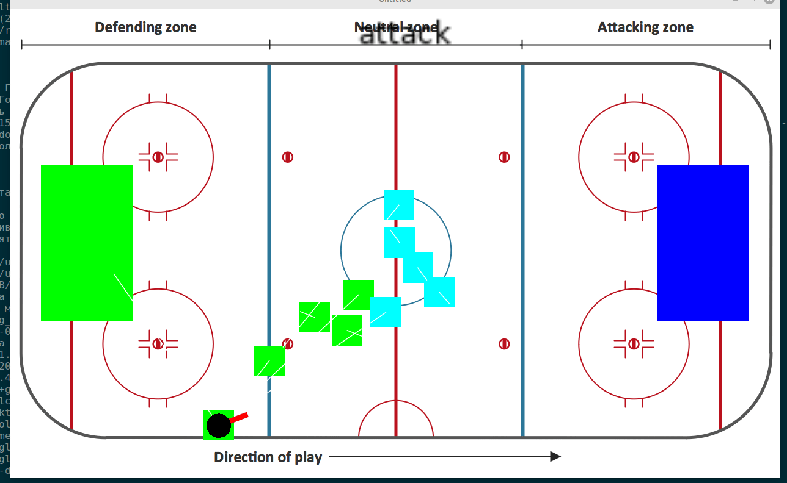

# State machine Part deux

Я сделал много всего.  
Добавил игроков в каждую команду, так что их теперь по 5 в каждой.
И сделал соответствнно в функциях update - цикл по всем игрокам, которые теперь 60 раз в секунду думают чем бы им занятся, и соответственно окунаются в одну из четырех новых функций
- attack
- hunt
- wait
- bump

## зачем нужен бамп
Да атем, что теперь спортсмены внимательно следят за своим личным пространством и при его нарушении сразу пытаются отступить. 

Получается забавно, особенно когда пачкой пинаются игроки в центре, и один самый удачливый сумел оторваться от кучи-малы и схватить шайбу.

А уж то что они шайбу не видят при этом и она у них "между ног" пролетает - отдельное удовольствие.

