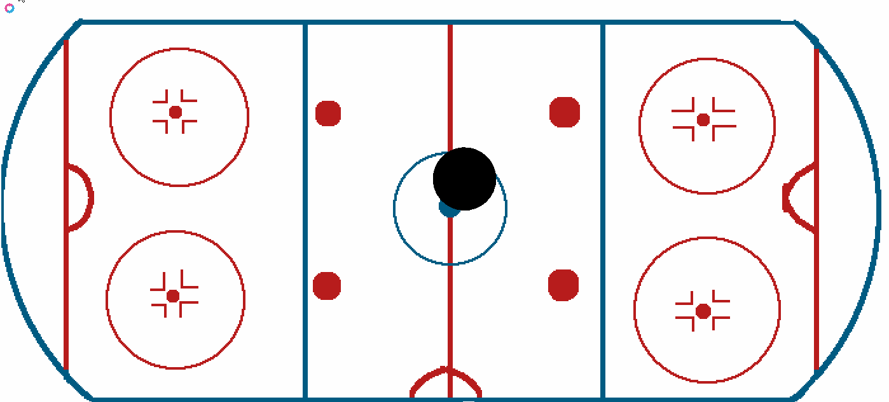

# Жизнь - Движение!
## Рефакторинг
Для тех кто не догадался, квадрат малевича должен двигаться по экрану. Причем желательно сам. Для этого я выделю его координаты в новые переменные, и даже соберу структуру (таблицу, в луа есть только таблицы) по имени Puck

```
Puck = {dx = 0.1, dy = 0.1, x = RinkX/2, y = RinkY/2, radius = 50}
```

И выделю отдельные функции 
```
function DrawPuck ()
    love.graphics.setColor (0,0,0)
    love.graphics.circle('fill', Puck.x, Puck.y, Puck.radius)
end

function UpdatePuck (dt)
    Puck.x = Puck.x+Puck.dx*dt
    Puck.y = Puck.y+Puck.dy*dt
end
```

Крысота!

## Think in the box

Теперь нужно сделать так чтобы шайб не улетал за границы экрана
```
function UpdatePuck (dt)
    local r = Puck.radius/2
    Puck.x = Puck.x+Puck.dx*dt
    Puck.y = Puck.y+Puck.dy*dt
    if (Puck.x <= r) then Puck.dx = -Puck.dx end
    if (Puck.y <= r) then Puck.dy = -Puck.dy end
    if (Puck.x+r >= RinkX) then Puck.dx = -Puck.dx end
    if (Puck.y+r >= RinkY) then Puck.dy = -Puck.dy end
end
```
Это уже финальный и немного причесанный вариант, сначала я забылся и отрицал сами координаты а не вектор движения, и шайб забавно глитчил.
 Кто-то может сказать что обрабатывать все это каждый фрейм может быть частовато, но я не знаю где еще это делать.

## Интерактив!
Наконец то подключаем интерфейс! 
```--input
function love.keypressed(key)
    if key == "escape" then
       love.event.quit()
    end
    if key == "space" then
        ResetPuck ()
    end
 end
```
Ну да и еще можно декоуплить функцию рестарта шайба
```
function  ResetPuck ()
    Puck = {dx = love.math.random( -500, 500 ), 
            dy = love.math.random( -500, 500 ), 
            x = RinkX/2, y = RinkY/2, radius = 50}
end
```
Теперь у меня официально больше интерактивных кнопок чем в издании РДР на пк. 

## Commit
[98b9e34](https://github.com/Schmel924/redesigned-guacamole/commit/98b9e34fea502fb264403fdb77e1699c70b9b5f8)

Я так и не понял должно ли оно работать самостоятельно, поэтому вставил сам полную ссылку.



## В следующей серии
Нужно сделать ворота, найти их на экране, придумать координаты, и вставить в `Updatepuck` проверку на попадание в ворота. Ну и эффект какой-нибудь, типа ресета

