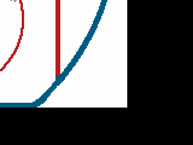

# Врезаемся по новому
Посмотрев видосы клёвого дядьки Javidx9, решил я внедрить его проверку на коллизии вместо той что была.
#### Первое что бросилось в глаза: 
я зачем-то делю радиус пополам. Теперь понятно почему шайб иногда залетал на четверть за край экрана. Ну как иногда, да почти всегда.

#### Второе: идея которую я беру из видоса проста: не делай вычисления одновременно с отрисовкой. 
## Вместо этого
Сначала вычисли что будет в следующем кадре, если за кадром - исправь, и только после этого данные попадают на экран. 
```
if (Puck.x+Puck.dx-Puck.radius < 0) 
    then 
        Puck.x = Puck.radius --радиус - это и есть растояние на которое центр круга должен отстоять от края
        Puck.dx = -Puck.dx 
        PuckDirect()         
    end
    if (Puck.y+Puck.dy-Puck.radius < 0) 
    then 
        Puck.y = Puck.radius
        Puck.dy = -Puck.dy 
        PuckDirect() 
    end
    if (Puck.x+Puck.radius+Puck.dx > RinkX) 
    then 
        Puck.x = RinkX - Puck.radius
        Puck.dx = -Puck.dx
        PuckDirect() 
    end
    if (Puck.y+Puck.radius+Puck.dy > RinkY) 
    then 
        Puck.y = RinkY - Puck.radius
        Puck.dy = -Puck.dy 
        PuckDirect() 
    end
```
#### Как, вы не знаете 
Что такое PuckDirect()?

Берем дельту\скорость шайба, нормализуем, и получаем направление движение. 
```
	local len = math.sqrt(Puck.dx^2+Puck.dy^2)
    Puck.dirx = Puck.dx/len
    Puck.diry = Puck.dy/len
```
Зачем? Чтобы рисовать вектор поверх шайба конечно, красиво же


## Но, возвращаясь к апдейту координат. 
А что если шайб не у стенки?
Тогда надо обновлять координаты по старинке `x = dx*dt` и тому подобное. 
А вот чтобы не было двух обновлений в один кадр (сначала об стенку, потом движение) добавим локальные флажки, и подергаем
```
  if (not x) then Puck.x = Puck.x+Puck.dx*dt end
  if (not y) then Puck.y = Puck.y+Puck.dy*dt end
```
Это все будет в коммите 913005с8 37 additions and 7 deletions.
<!---
Ни хуя эти ссылки не работают
https://github.com/jlord/sheetsee.js/commit/a5c3785ed8d6a35868bc169f07e40e889087fd2e
-->
Дальше я поудалял разные комменты, ибо текст проги и так понятен.

И добавил еще одну функцию внутрь love.update
```
 if love.mouse.isDown(1)
    then 
       local x,y = love.mouse.getPosition()
        Puck.dx = x - Puck.x
        Puck.dy = y - Puck.y
        PuckDirect()
    end    
```    

